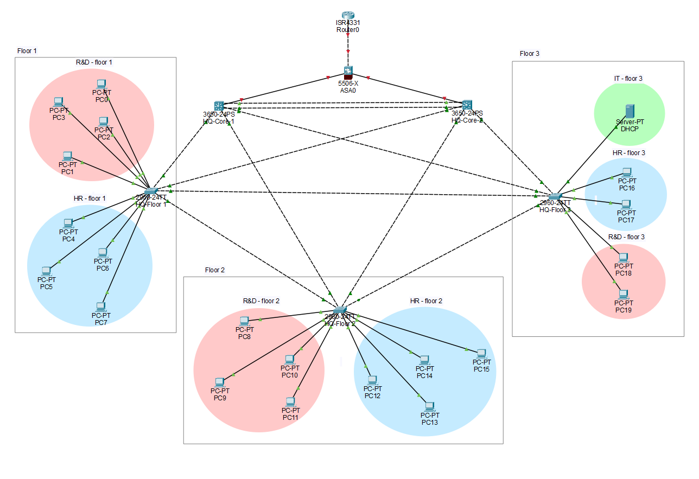

# Enterprise HQ Network Architecture (Layer 2 & Layer 3)

## Project Overview

This repository contains the baseline architecture for a highly available, deeply secure internal enterprise network. It demonstrates advanced routing, switching, localized security protocols, and centralized IP management.

## Core Technologies & Protocols

- **High Availability (HSRP):** Configured symmetrical Active/Standby gateway redundancy across dual Cisco 3650 Multilayer Core switches to ensure zero downtime for edge users.
- **Centralized DHCP Relay:** Deployed a dedicated DHCP server in the IT sector (VLAN 30), utilizing `ip helper-address` commands across SVIs to service cross-departmental requests.
- **Layer 2 Edge Security:** Hardened user-facing access ports using Port Security (Sticky MAC, Restrict violations) and BPDU Guard to neutralize rogue switches and unauthorized devices.
- **Spanning Tree Optimization:** Implemented Rapid-PVST and manually hardened Root Bridge priorities to dictate traffic flow and prevent hostile Spanning Tree topology takeovers.
- **Trunk Hardening:** Secured 802.1Q trunks by explicitly disabling DTP (`nonegotiate`) to prevent VLAN hopping attacks.
- **Management Plane Security:** Secured device access via encrypted console/VTY lines and hashed enable secrets.

## Network Topology

## Device Configurations

The raw startup configurations for the Core and Access switches can be audited in the `/Configs` directory.
